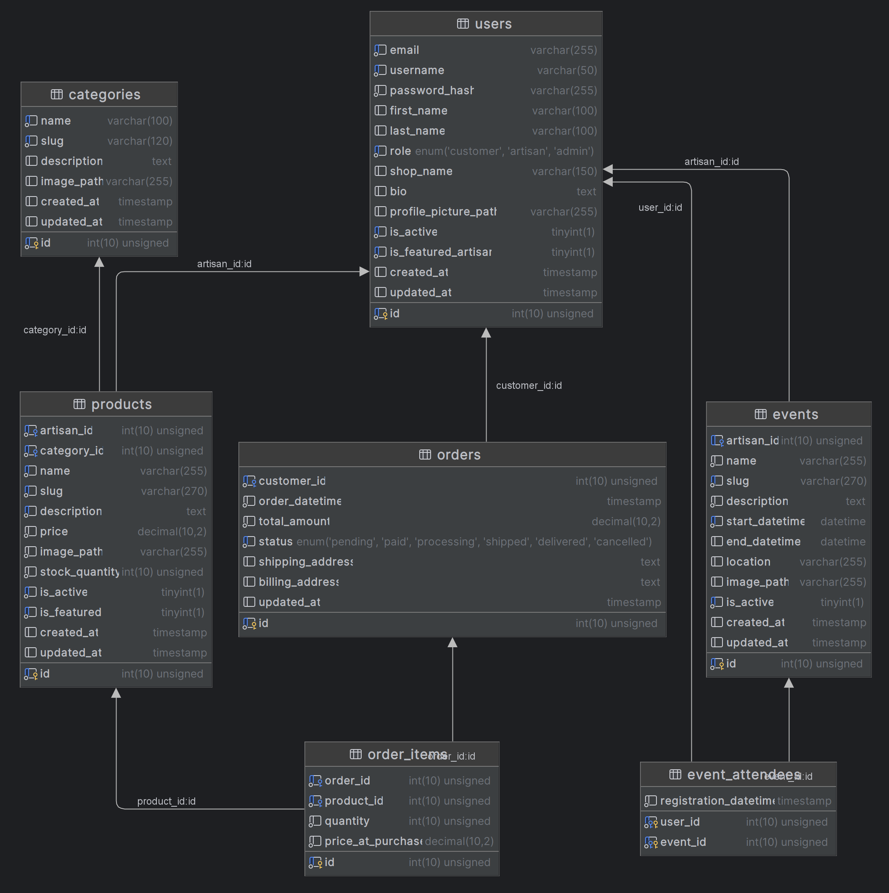

# AppWebsite

Welcome to the website of the G7C APP group.

Recall of the project:

### Topic 4: Sales and promotion platform for artisans and creators

The goal of the project is to develop a website allowing artisans and independent creators (jewelers, ceramicists, woodworkers, etc.) to showcase and sell their creations.
Each artisan can list their products for sale or through a custom order system, providing details about each piece (materials used, dimensions, price, production time, etc.).
The site would also include a section to promote events such as craft fairs, workshops, or exhibitions.
Finally, a virtual gallery could be integrated to allow visitors to explore the artisans' collections in an immersive environment.

## Basics info

### Prerequisites

- Install [XAMPP](https://www.apachefriends.org/fr/index.html).
- Use either [VS Code](https://code.visualstudio.com) or [IntelliJ IDEA](https://www.jetbrains.com/idea/) as editors.

### Installation

- Open the terminal at the `C:\xampp\htdocs` folder.
- Clone the github repository:

```
git clone https://github.com/Cuuuuube/AppWebSite.git
```

### Execute

- In XAMPP, run the following modules: Apache and MySQL.
- Go to `http://localhost/AppWebSite/` to see the website.
- Go to `http://localhost/phpmyadmin/index.php` to open PHPMyAdmin.

### Setup

- In PHPMyAdmin, create a database called `artisan_station_db`.
- In PHPMyAdmin, in the section `SQL`, copy the text from `artisan_station_db.txt` and run the queries.
- Copy and rename the file `/config/database.example.php` to `/config/database.php` and enter the username/password given by the administrator
- Important: Do not delete the file `/config/database.example.php`

## Database diagram

Below is the diagram of the current version of the database. The scheme will be updated as the database is updated.


